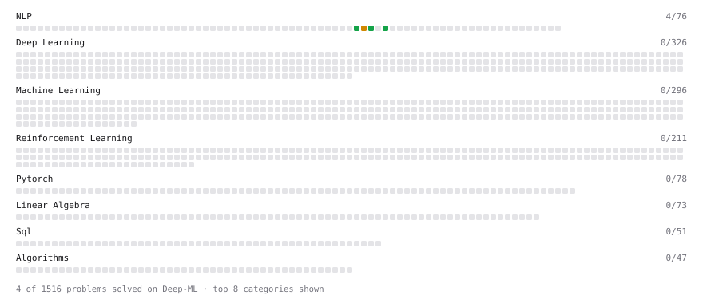

# Deep-ML

My machine learning practice from [Deep-ML](https://www.deep-ml.com). Every solution here was written by hand.

**2** solved · 2 problems · 0 labs · 0 math

[**Browse the interactive portfolio**](https://will-larkin.github.io/deep-ml/) to replay this filling in over time.

## Problems

| | Difficulty | Solved | |
| --- | --- | --- | --- |
| [Calculate Vocabulary Size from Token List](https://www.deep-ml.com/problems/953) | easy | 2026-10-03 | [solution](problems/0953-calculate-vocabulary-size-from-token-list) |
| [Replace Token Pair in BPE Sequences](https://www.deep-ml.com/problems/949) | easy | 2026-10-03 | [solution](problems/0949-replace-token-pair-in-bpe-sequences) |

---

_This file is regenerated by Deep-ML on every push._
